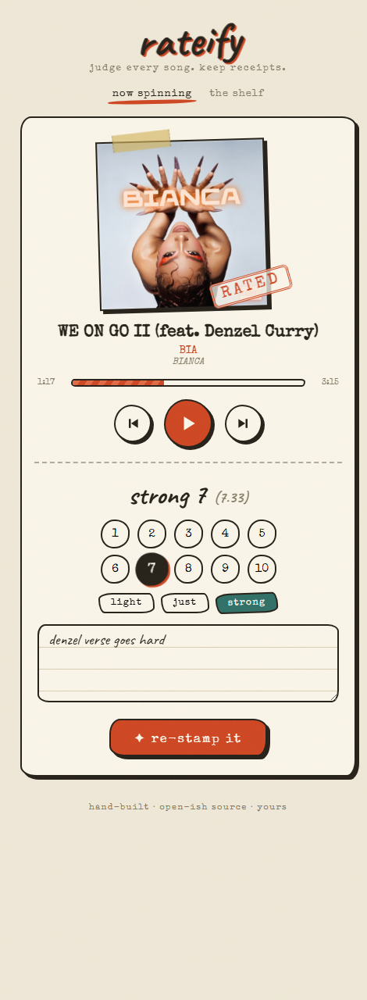
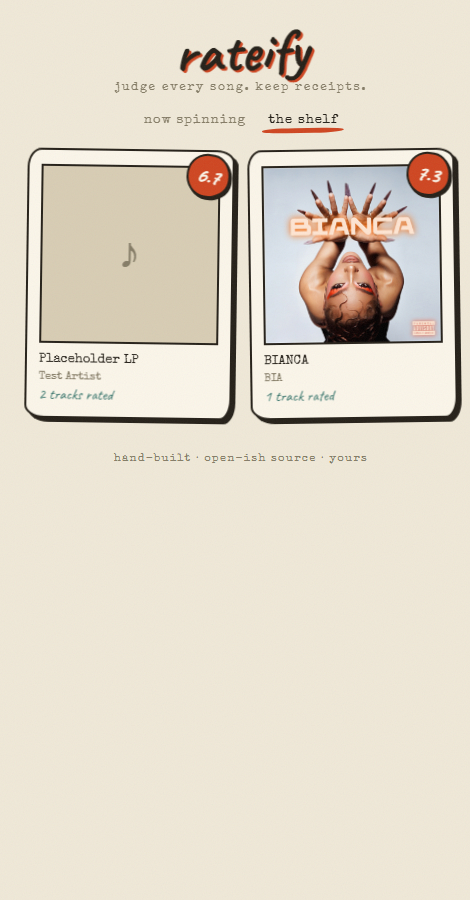

# rateify ♪

*judge every song. keep receipts.*

A tiny Windows widget that shows what Spotify is playing and lets you stamp a
verdict on every song — typewriter, handwriting, washi tape and all.

<p align="center">
  
  
</p>

## Why it's neat

- **No Spotify API keys, no OAuth, no account.** It reads the Windows media
  session (SMTC), so it just works with the Spotify desktop app — or anything
  else that plays media.
- **Media buttons** — previous / play-pause / next, with a vinyl that slides
  out and spins while music plays.
- **An opinionated rating scale** — `light 1 → 1 → strong 1 → … → strong 9 →
  light 10 → 10` (light = −⅓, strong = +⅓ when averaging). Because sometimes
  a 7 is *barely* a 7.
- **Notes** — scribble why, saved with the rating.
- **The shelf** — everything grouped by album with the real cover art and the
  album average (plain mean of its rated tracks).
- **Honest storage** — one human-readable `data/ratings.json`, covers cached
  as plain images in `covers/`. Grep it, back it up, take it with you.

## Install

Grab the latest [release](../../releases):

- **`Rateify-Setup-x.y.z.exe`** — per-user installer, no admin needed, adds a
  start-menu (and optionally desktop) shortcut.
- **`Rateify-x.y.z-portable.zip`** — unzip anywhere and run `Rateify.exe`.

Launching it again while it's running just refocuses the page. Your library
lives in `data/` next to the exe and survives updates and uninstalls.

## Run from source

```
pip install -r requirements.txt
python app.py
```

Opens `http://127.0.0.1:7700`. Requires Windows 10/11 and Python 3.10+.

To build the exe / installer yourself, see [docs/RELEASING.md](docs/RELEASING.md).

## Fonts

[Special Elite](https://fonts.google.com/specimen/Special+Elite) (Apache 2.0)
and [Caveat](https://fonts.google.com/specimen/Caveat) (OFL), bundled in
`static/fonts/`.

## License

[MIT](LICENSE) — hand-built · open source · yours.
